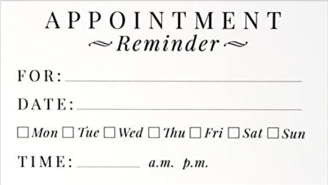
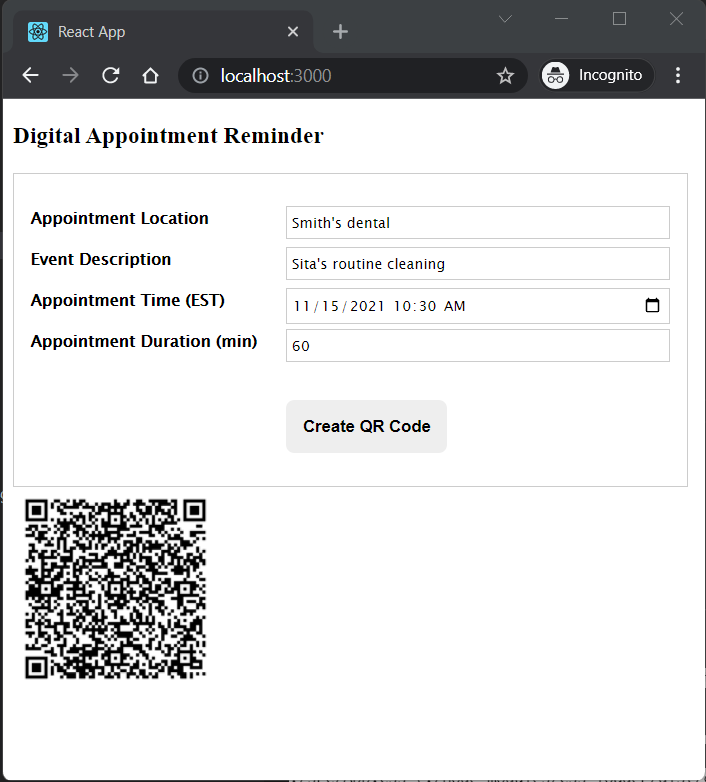
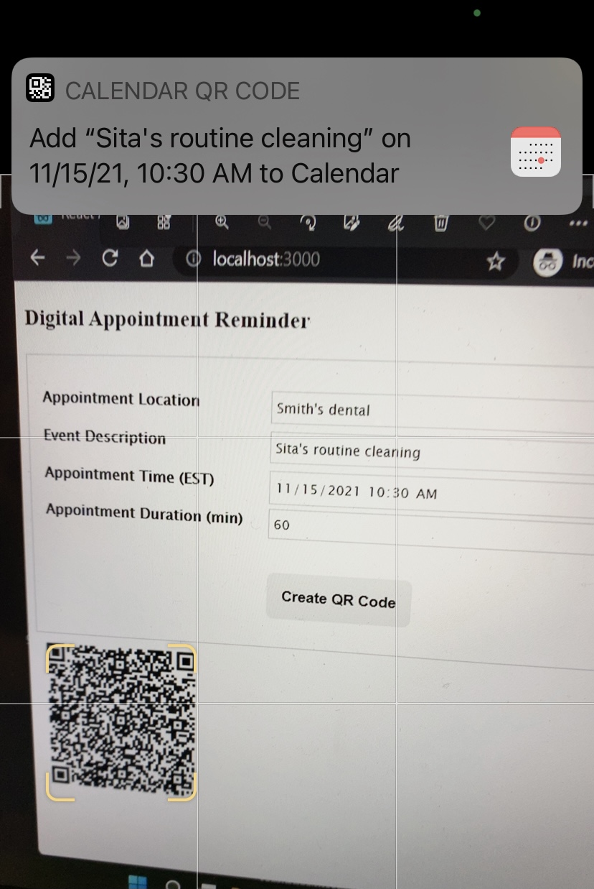
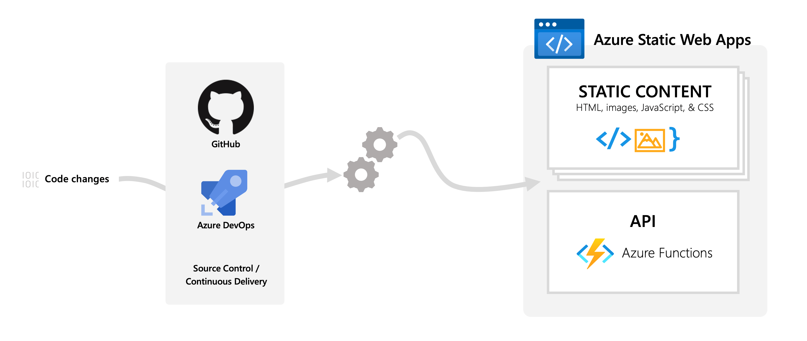

# Creating a digital product for the doctor's office

## Background
Last week, I was at my dentist's office for a routine visit. The cleaning process revealed I have a few cavities that need fixed soon. I setup a follow-up appointment for fillings at the end of my visit. The office staff setup a date on the doctor's calendar and wrote down the date and time on an appointment reminder card and shared it with me. The card looks similar to the one shown below



Soon, I opened my calendar on my iPhone and manually entered the info to create a new digital event/reminder and threw the reminder paper card in the trash. I felt there must be a better way to add events to multiple calendars (doctor's and mine in this case) without needing these paper cards in the first place.

I used a few high level requirements to build a working prototype for additional validation in the market. The requirements are 
1. Highly usable: a doctor's office appointment should be added to a client's electronic calender with minimum manual intervention
2. Save money and time: to doctor's office and to the client
3. Environment friendliness: eliminate the environmental impact from making and disposing these paper based appointment cards 
4. Cloud native architecture: pay per use, loosely coupled, highly available, auto scaleable, low latency and an automated process to help with development/ops toil

## Idea
A web based product that will allow a staff at the doctor's office to enter appointment information and generate a QR (quick response) code on a monitor. A client with a smart phone can use their camera to scan the QR code and add an event with reminder to their calendar quickly. The QR code details will be used to create an event automatically avoiding manual entries for the most part. This workflow will eliminate the need for the paper based reminder cards completely.


## Value proposition
Paper model: a doctor's office giving 400 cards per month costs around 50$ - 20 cards each day for 20 days in a month; cost estimate pulled from amazon.com for a basic card design and quality.

Digital model: Azure cloud total cost around 10$ per month; static web app at 10$/month plus 0$ using function app consumption plan for 400 calls each month ; cost estimate pulled from Azure pricing site.

As can be seen above, doctor's office can expect savings each month; more importantly, they will be reducing the impact of print production and paper on the environment. The new workflow will provide an easy and quick way for clients to add new appointments to their calender. 

## New experience

## Doctor's office staff: use new web application to create and share a qr code with their client



## Client: scan the qr code using their smartphone and add an event to their calender quickly 



## Reference architecture, and technology



Azure static web apps, function app, and QRCoder library were used to build this application; see below for a reference architecture
https://azure.microsoft.com/en-us/services/app-service/static/

## Code notes

## User interface
This user interface is a single page app built using React library; see code in this repository for the full application user interface source code. Github workflow is used for CI/CD.
	
## API
The api is an azure function as show below

```
[FunctionName("appointments")]
public async Task<IActionResult> Run(
    [HttpTrigger(AuthorizationLevel.Anonymous, "post", Route = null)] HttpRequest req)
{
    _logger.LogInformation("C# HTTP trigger function processed a request.");

    string requestBody = String.Empty;
    using (StreamReader streamReader =  new  StreamReader(req.Body))
    {
        requestBody = await streamReader.ReadToEndAsync();
    }
    dynamic data = JsonConvert.DeserializeObject(requestBody);

    string userNickName = data?.name;
    if(string.IsNullOrEmpty(userNickName)){
        return new BadRequestResult();
    }
    string apptLocationName = data?.loc;
    if(string.IsNullOrEmpty(apptLocationName)){
        return new BadRequestResult();
    }

    string dateTimeText = data?.time;
    DateTime apptDateTimeAt = DateTime.Now;
    if(!DateTime.TryParse(dateTimeText, out apptDateTimeAt)){
        return new BadRequestResult();
    }

    string durationText = data?.dur;
    double duration = 0;
    if(!double.TryParse(durationText, out duration)){
        return new BadRequestResult();
    }
    DateTime apptDateTimeEnd = apptDateTimeAt.AddMinutes(duration);

    PayloadGenerator.CalendarEvent generator = new PayloadGenerator.CalendarEvent(userNickName, apptLocationName,string.Empty, apptDateTimeAt, apptDateTimeEnd, false);
    string payload = generator.ToString();
    QRCodeGenerator qrGenerator = new QRCodeGenerator();
    QRCodeData qrCodeData = qrGenerator.CreateQrCode(payload, QRCodeGenerator.ECCLevel.Q);
    QRCode qrCode = new QRCode(qrCodeData);
    using (var stream = new MemoryStream())
    {
        qrCode.GetGraphic(20).Save(stream, System.Drawing.Imaging.ImageFormat.Png);
        return new FileContentResult(stream.ToArray(), "image/png");
    }
}
```
	
## Helpful debugging tools
VS Code, Fiddler, and Chrome dev tools 

